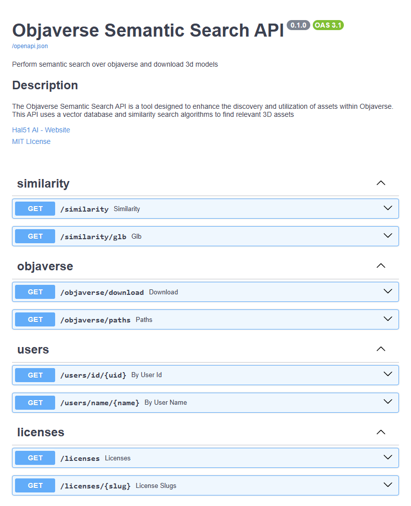

# Objaverse Semantic Search API

[](https://github.com/Hal51AI/ObjaverseSemanticSearch/actions/workflows/mypy.yml)



## Install Dependencies

You can install dependencies using pip

```bash
pip install -r requirements.txt
```

## Run Locally

Once all dependencies are installed and embeddings are generated, the easiest way to run a local environment is to run

```bash
fastapi dev
```

## Run on Docker

To build with docker, we can run

```bash
docker build -t objaverse-semantic-search .
```

Then to run it, you can run

```bash
docker run -it -v ./data:/app/data -p 8000:8000 objaverse-semantic-search
```

All these operations assume you will have a pre-built embeddings file and it is stored at `./data`

## Run on Docker Compose

The easiest way to run is with docker compose, run

```bash
docker compose up
```

# Configuration

A sample configuration file is provided as `.env.example` Copy it to `.env` to customize your settings:

```bash
cp .env.example .env
```

Set the following variables in the configuration file in `.env`:
- `CAPTIONS_FILE`: Path to the captions CSV file.
- `DATABASE_PATH`: Path to the SQLite database.
- `EMBEDDINGS_FILE`: Precomputed embeddings file.
- `SENTENCE_TRANSFORMER_MODEL`: Model used for embeddings (default: `all-MiniLM-L6-v2`).
- `SIMILARITY_SEARCH`: Choose the search method (e.g., `BruteForceSimilarity`, `IVFSimilarity`, `IVFPQSimilarity`, etc.).

# First Run Setup

On the very first run, the application checks if both the embeddings and database files exist at paths specified by the environment variables `EMBEDDINGS_PATH` and `DATABASE_PATH`.

- If the file at `EMBEDDINGS_PATH` is missing, the application will generate embeddings by processing the designated caption CSV file. This ensures that a new embeddings file is created and stored in the expected location.
- Similarly, if the file at `DATABASE_PATH` does not exist, the application will initialize a new SQLite database. This process includes setting up the required schema and populating initial metadata for a seamless startup.

Ensure that both `EMBEDDINGS_PATH` and `DATABASE_PATH` are correctly set in your environment variables or the `.env` file before the first run.

> **Warning:** Creating embeddings and initializing the database might take a significant amount of time depending on your CPU power and dataset size. Please ensure that your machine has sufficient resources to handle the process.

# API Endpoints

### Similarity
- **GET /similarity**  
  Performs a similarity search and returns relevant 3D asset metadata.
  **Example:**  
  `/similarity?query=a%20boat&top_k=5`
- **GET /similarity/glb**  
  Returns a randomly selected glb file based on similarity score.

### Users
- **GET /users/id/{uid}**  
  Retrieves user data based on user ID.
- **GET /users/name/{name}**  
  Retrieves user data based on user name.

### Objaverse
- **GET /objaverse/download**  
  Downloads one or many base64 encoded glb files by objaverse id(s).
- **GET /objaverse/paths**  
  Provides download URLs for the requested objaverse ids.

### Licenses
- **GET /licenses**  
  Fetches all available license information.
- **GET /licenses/{slug}**  
  Retrieves details for a specific license based on its slug.

# Troubleshooting

- Ensure that your embeddings file is pre-built and placed at the expected location (`./data`).
- Check database connectivity if queries return no results.
- Verify environment variables if the API fails to start.